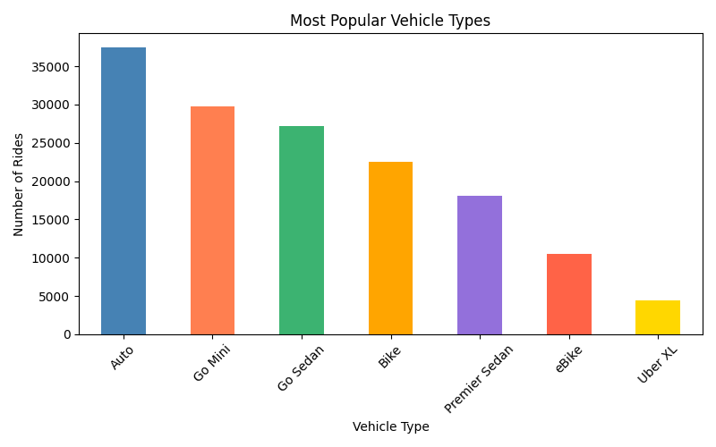
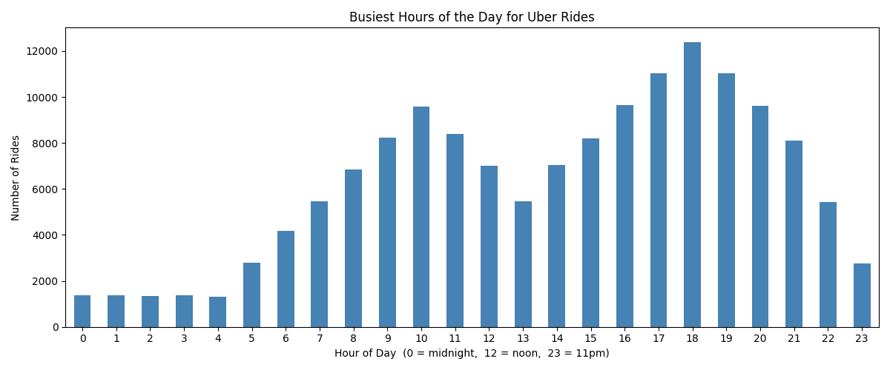
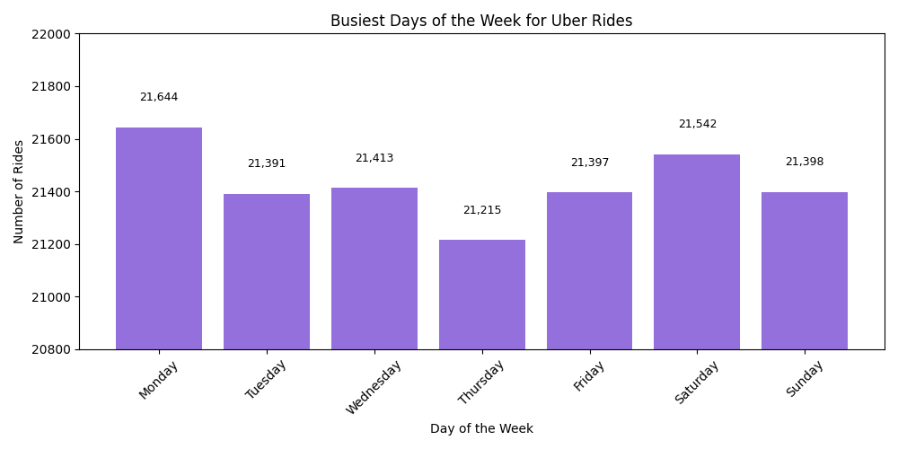
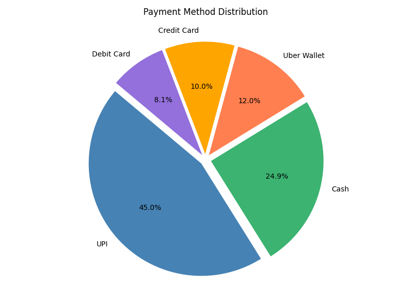
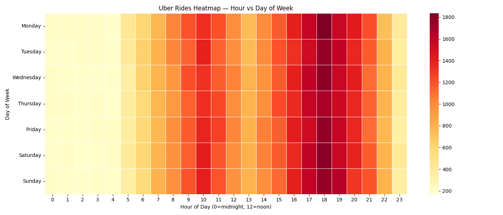
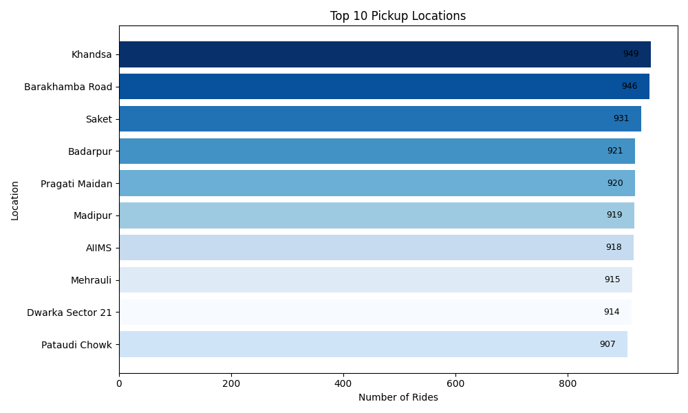

# 🚗 Uber Data Analysis Project

A data analysis and visualization project built on Uber ride booking data.
This project explores booking patterns, vehicle preferences, payment methods,
and peak hours using Python and popular data visualization libraries.

---

## 📁 Project Structure

```
UBER-ANALYSIS/
├── outputs/
│   ├── busiest_days.png
│   ├── busiest_hours.png
│   ├── heatmap.png
│   ├── payment_pie.png
│   ├── top_pickups.png
│   └── vehicle_types.png
├── uber_analysis.ipynb
├── README.md

```

---

## 📊 Charts & Visualizations

### 1. Booking Status Distribution


### 2. Most Popular Vehicle Types


### 3. Busiest Hours of the Day


### 4. Busiest Days of the Week


### 5. Payment Method Distribution


### 6. Heatmap — Hour vs Day of Week


### 7. Top 10 Pickup Locations


---

## 🔍 Key Insights

- **93,000 rides** were successfully completed out of 150,000 total bookings
- **Driver cancellations** are the biggest problem with 27,000 cancelled rides
- **Auto** is the most popular vehicle type with 37,000+ rides
- **Evening 6pm** is the absolute busiest time across all days of the week
- **UPI** dominates payments at 45% — almost half of all transactions
- **Khandsa** and **Barakhamba Road** are the top pickup locations
- Ride demand is **consistent across all days** of the week

---

## 🛠️ Libraries Used

- `pandas` — data loading and cleaning
- `numpy` — numerical operations
- `matplotlib` — charts and visualizations
- `seaborn` — heatmap visualization
- `jupyter` — interactive notebook environment

---

## ▶️ How to Run

**Step 1 — Install required libraries:**
```bash
pip install pandas numpy matplotlib seaborn jupyter openpyxl
```

**Step 2 — Clone this repository:**
```bash
git clone https://github.com/yourusername/uber-analysis.git
cd uber-analysis
```

**Step 3 — Add the dataset:**
- Download `uber_data.xlsx` and place it in the project root folder
- (Dataset is not included in this repo due to file size)

**Step 4 — Open the notebook:**
```bash
jupyter notebook uber_analysis.ipynb
```

**Step 5 — Run all cells:**
- Click **Kernel → Restart & Run All**
- All charts will be saved automatically in the `outputs/` folder

---

## 📌 Notes

- The dataset file `uber_data.xlsx` is not uploaded to GitHub due to its large size
- All generated charts are saved in the `outputs/` folder as PNG files
- Notebook was built and tested in Jupyter Notebook with Python 3

---

## 🙋 Author
**Vidhi Mittal **
- 📧 vidhimittal353@gmail.com
- 💼 [LinkedIn](https://www.linkedin.com/in/vidhi-mittal-30a07a303/)
- 🐙 [GitHub](https://github.com/vidhim06)

## 📜 License
This project is open source and available under the [MIT License](LICENSE).

---
